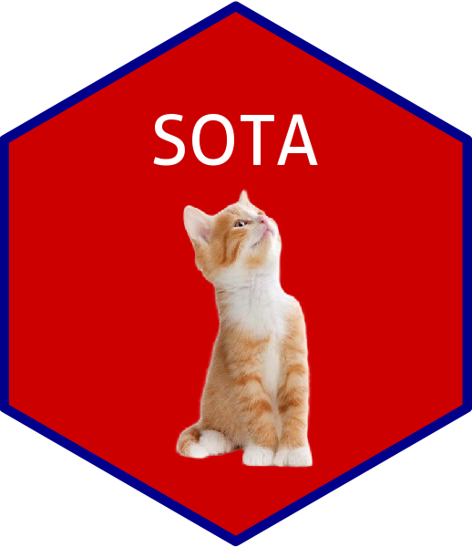

   

# Awesome-Deep-Learning-in-Biology-and-Disease-Papers 

This is a curated collection of papers about ``deep learning applications`` in biology and disease, each providing code for learning or reproducibility purposes.

## Table of Contents

- [Guidelines or reviews for deep learning applications](#guidelines-or-reviews-for-deep-learning-applications)
- [Genome](#genome)
- [Transcriptome](#transcriptome)
- [Epigenome](#epigenome)
- [Proteome](#proteome)
- [Metabolomics](#metabolomics)
- [microbiome](#microbiome)
- [Multiomics](#multiomics)
- [Research group](#research-group)

## Guidelines or reviews for deep learning applications
1. [2022 Nature Reviews Genetics]**Navigating the pitfalls of applying machine learning in genomics**[[paper]](https://doi.org/10.1038/s41576-021-00434-9)

2. [2023 Nature Reviews Genetics]**Obtaining genetics insights from deep learning via explainable artificial intelligence**[[paper]](https://doi.org/10.1038/s41576-022-00532-2)

## Genome
1. [2023 Nature Genetics]**Inference of chronic obstructive pulmonary disease with deep learning on raw spirograms identifies new genetic loci and improves risk models**[[paper]](https://doi.org/10.1038/s41588-023-01372-4)[[code]](https://github.com/Google-Health/genomics-research/tree/main/ml-based-copd)

## Transcriptome
1. [2021 Nature Biotechnology]**Prediction of drug efficacy from transcriptional profiles with deep learning**[[paper]](https://doi.org/10.1038/s41587-021-00946-z)[[code]](https://github.com/kekegg/DLEPS)

2. [2023 Nature Biotechnology]**Supervised discovery of interpretable gene programs from single-cell data**[[paper]](https://doi.org/10.1038/s41587-023-01940-3)[[code]](https://github.com/dpeerlab/spectra/)

## Epigenome
1. 

## Proteome
1.  [2017 PNAS]**De novo peptide sequencing by deep learning**[[paper]](https://doi.org/10.1073/pnas.1705691114)[[code]](https://github.com/nh2tran/DeepNovo)

## Metabolomics
1. 

## microbiome
1. 

## Multiomics
1. 

## Research group
1.